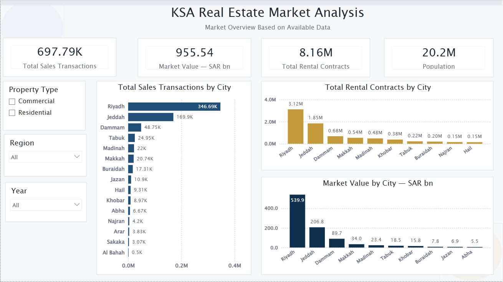
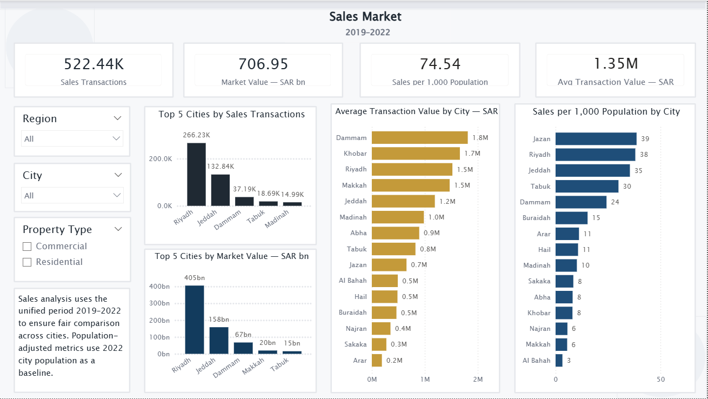
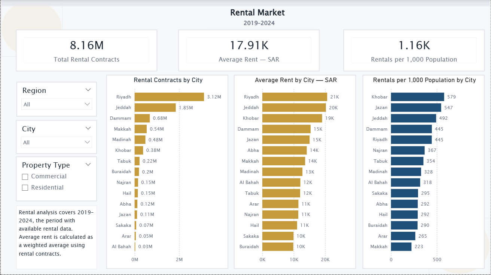
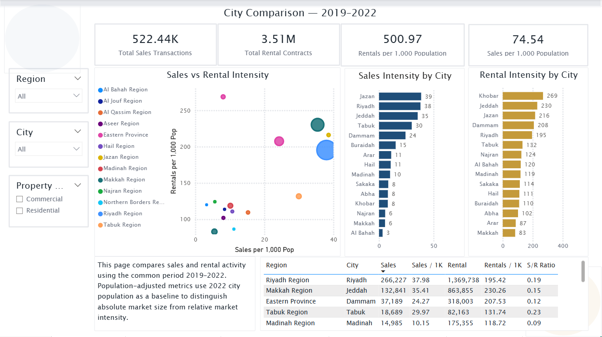
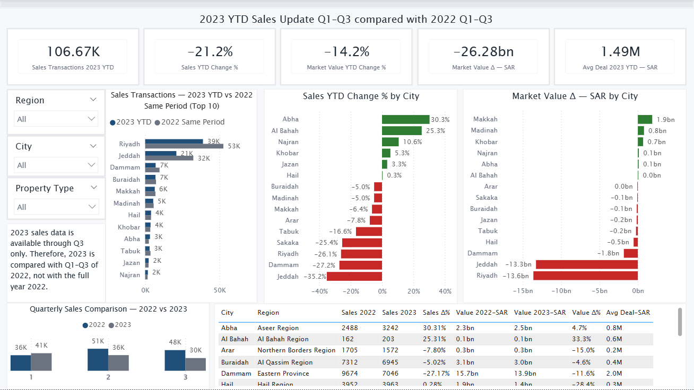
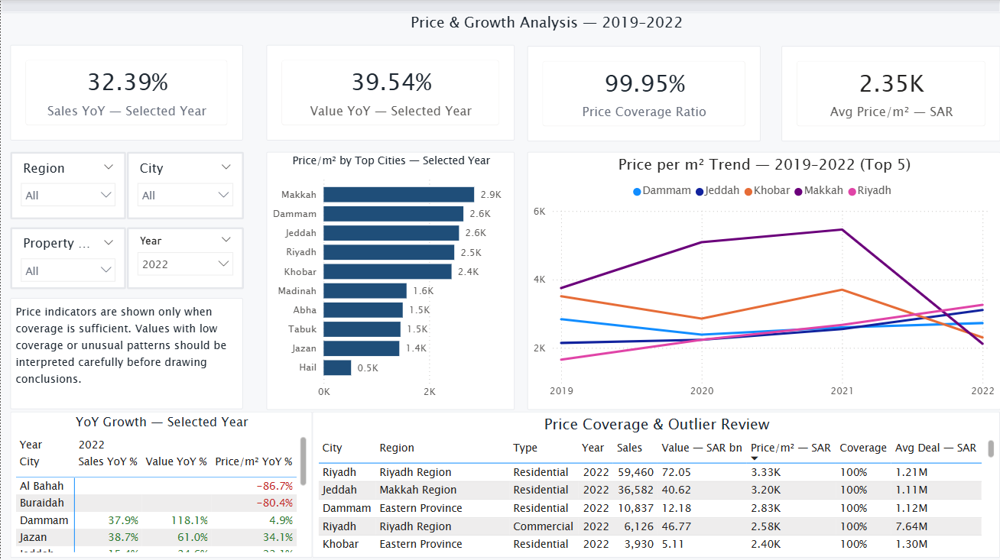
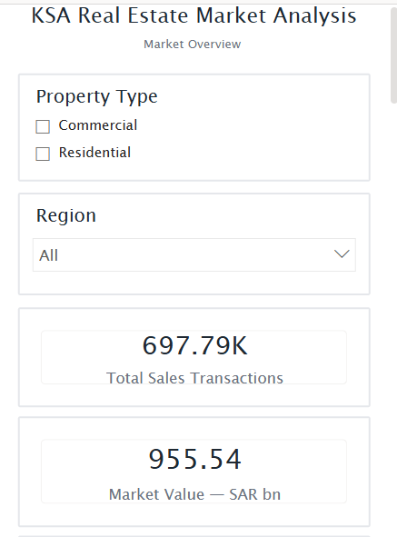

# KSA Real Estate Market Analysis


## Project Overview

This project analyzes the Saudi real estate market across selected major cities using sales, rental, population, and macroeconomic indicators.

The analysis focuses on understanding market activity, rental dynamics, city-level differences, 2023 year-to-date changes, and price-per-square-meter patterns using an interactive Power BI dashboard.

The final dashboard includes both desktop and mobile-optimized layouts.

---

## Business Questions

The project was designed to answer the following questions:

1. Which Saudi cities have the highest real estate sales activity?
2. How does market value differ across cities and property types?
3. Which cities lead in rental contract activity?
4. How do sales and rental indicators change when adjusted by population?
5. How did 2023 Q1–Q3 sales performance compare with the same period in 2022?
6. Which cities show unusual price-per-square-meter or growth patterns?
7. How can real estate activity be compared fairly across cities of different population sizes?

---

## Dashboard Preview

### Market Overview



### Sales Market



### Rental Market



### City Comparison



### 2023 YTD Sales Update



### Price & Growth Analysis



---

## Mobile Layout Preview

The report also includes a mobile-optimized layout designed for quick review on smartphones.




---

## Data Sources

The project uses data collected and prepared from multiple public and structured sources, including:

- Real estate sales transactions
- Rental contract data
- City-level population data
- Average income indicators
- Inflation rate data
- Repo rate data

The final model uses cleaned and processed datasets prepared specifically for Power BI reporting.

---

## Data Coverage

The dashboard separates analysis periods carefully based on data availability:

| Analysis Area | Period Used | Notes |
|---|---:|---|
| Market Overview | Available data | Broad overview using available sales and rental periods |
| Sales Market | 2019–2022 | Main complete sales comparison period |
| Rental Market | 2019–2024 | Rental data available for a longer period |
| City Comparison | 2019–2022 | Common comparison period for sales and rental activity |
| 2023 YTD Update | 2023 Q1–Q3 vs 2022 Q1–Q3 | Like-for-like year-to-date comparison |
| Price & Growth Analysis | 2019–2022 | Focused on price-per-square-meter and YoY growth |

---

## Data Model

The Power BI model follows a simple star-schema structure.

### Fact Table

`fact_real_estate_quarterly`

Main grain:

```text
city + quarter_key + property_type
```

Key fields include:

- Sales transactions
- Market value
- Average price per square meter
- Rental contracts
- Average rent
- Population-related indicators
- Macroeconomic indicators

### Dimension Tables

| Table | Description |
|---|---|
| `dim_city` | City, region, and population attributes |
| `dim_date` | Quarter and year structure |
| `dim_property_type` | Residential and commercial property types |
| `analysis_scope` | Helper table for documenting analysis periods |

---

## Dashboard Pages

### 1. Market Overview

Provides a high-level overview of market activity based on available data.

Main indicators:

- Total sales transactions
- Total market value
- Total rental contracts
- Population
- Sales activity by city
- Rental activity by city
- Market value by city

---

### 2. Sales Market — 2019–2022

Focuses on the real estate sales market during the main complete comparison period.

Main indicators:

- Sales transactions
- Market value
- Average transaction value
- Sales per 1,000 population
- Top cities by sales transactions
- Top cities by market value

---

### 3. Rental Market — 2019–2024

Analyzes rental contract activity across cities and property types.

Main indicators:

- Rental contracts
- Weighted average rent
- Rentals per 1,000 population
- Rental contracts by city
- Rental intensity by city

---

### 4. City Comparison — 2019–2022

Compares cities using both absolute and population-adjusted metrics.

Main indicators:

- Sales transactions
- Rental contracts
- Sales per 1,000 population
- Rentals per 1,000 population
- Sales-to-rental intensity ratio

This page helps separate market size from relative market intensity.

---

### 5. 2023 YTD Sales Update

Compares 2023 Q1–Q3 sales performance with the same period in 2022.

Main indicators:

- 2023 YTD sales transactions
- Sales YTD change %
- Market value YTD change %
- Market value change
- Average transaction value

This page avoids comparing partial-year 2023 data with full-year 2022 data.

---

### 6. Price & Growth Analysis — 2019–2022

Focuses on price-per-square-meter and year-over-year growth patterns.

Main indicators:

- Weighted average price per square meter
- Price coverage ratio
- Sales YoY %
- Market value YoY %
- Price-per-square-meter trend
- Outlier and coverage review

Unusual price movements are treated carefully and reviewed as potential data or market anomalies.

---

## Key Insights

Some of the main analytical findings include:

- Major cities dominate absolute real estate activity, especially in sales transactions and total market value.
- Population-adjusted metrics reveal a different picture from absolute transaction volume.
- Rental market activity shows broader coverage over time compared with sales data.
- 2023 Q1–Q3 performance should be interpreted as a year-to-date comparison only, not as a full-year market decline.
- Price-per-square-meter analysis requires caution because unusual movements may reflect data coverage, property mix, or city-specific transaction patterns.
- Combining absolute metrics with per-capita indicators provides a more balanced city comparison.

---

## Tools Used

| Tool | Purpose |
|---|---|
| Python | Data cleaning, preparation, validation |
| Pandas | Data transformation and aggregation |
| Power BI | Data modeling, DAX measures, dashboard design |
| DAX | Analytical measures and business logic |
| Excel / CSV | Intermediate data review and storage |

---

## Methodology

The project followed these main steps:

1. Collected and reviewed real estate sales, rental, population, and macroeconomic data.
2. Cleaned city names, region names, date fields, and property type categories.
3. Standardized quarterly keys for time-based modeling.
4. Aggregated sales and rental data at a consistent quarterly grain.
5. Built a star-schema model in Power BI.
6. Created DAX measures for sales, rentals, market value, weighted averages, per-capita indicators, YoY growth, and YTD comparison.
7. Designed a six-page Power BI dashboard.
8. Added a mobile-optimized layout for smartphone viewing.
9. Reviewed data limitations and added contextual notes to avoid misleading comparisons.

---

## Main DAX Concepts

The dashboard uses several analytical DAX patterns, including:

- Total aggregation measures
- Weighted averages
- Population-adjusted metrics
- Year-over-year growth
- Year-to-date comparison
- Same-period comparison
- Coverage ratio checks
- Filter context control using `CALCULATE` and `REMOVEFILTERS`

Detailed DAX measures are documented in:

```text
dax/measures.md
```

---

## Data Limitations

Important limitations were considered during the analysis:

- Sales data and rental data do not cover the exact same periods.
- 2023 sales data is treated as Q1–Q3 year-to-date only.
- 2024 sales data was not used in the sales analysis due to lack of coverage.
- Population data is used as a city-level baseline and does not vary quarterly.
- Price-per-square-meter values require coverage checks before interpretation.
- Some unusual city-level price or growth movements may reflect transaction mix, coverage, or data availability rather than direct market movement.

---

## Repository Structure

```text
ksa-real-estate-market-analysis/
│
├── README.md
├── LICENSE
├── .gitignore
│
├── dashboard/
│   └── KSA_Real_Estate_Market_Analysis.pbix
│
├── data/
│   ├── processed/
│   │   ├── fact_real_estate_quarterly.csv
│   │   ├── dim_city.csv
│   │   ├── dim_date.csv
│   │   ├── dim_property_type.csv
│   │   └── analysis_scope.csv
│   │
│   └── raw/
│       └── README.md
│
├── notebooks/
│   ├── 01_data_cleaning.ipynb
│   ├── 02_data_modeling.ipynb
│   └── 03_analysis_preparation.ipynb
│
├── dax/
│   └── measures.md
│
├── images/
│   ├── desktop_overview.png
│   ├── desktop_sales.png
│   ├── desktop_rentals.png
│   ├── desktop_city_comparison.png
│   ├── desktop_ytd.png
│   ├── desktop_price_growth.png
│   ├── mobile_overview.png
│   └── mobile_sales.png
│
└── docs/
    ├── methodology.md
    ├── data_dictionary.md
    └── limitations.md
```

---

## How to Use

1. Download or clone this repository.
2. Open the Power BI file from the `dashboard/` folder.
3. Review the processed data files in `data/processed/`.
4. Explore the methodology and limitations in the `docs/` folder.
5. Review DAX measures in `dax/measures.md`.

---

## Author

**Asem Haij**  
Mathematician | Data & Analytics Consultant | Python • Power BI • SQL

- LinkedIn: [linkedin.com/in/asem-haij-9797562a8](https://www.linkedin.com/in/asem-haij-9797562a8)
- GitHub: [github.com/ProfASEM](https://github.com/ProfASEM)
- Portfolio: [asemhaij.com](https://asemhaij.com)

---

## License

This project is shared for educational and portfolio purposes.

